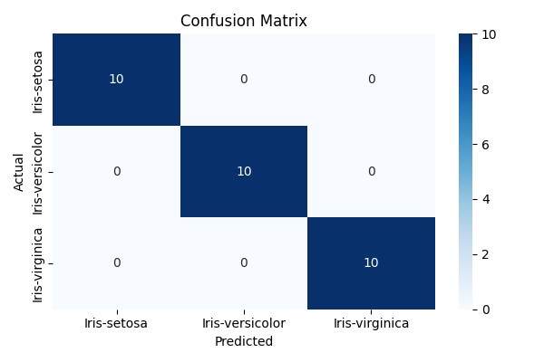
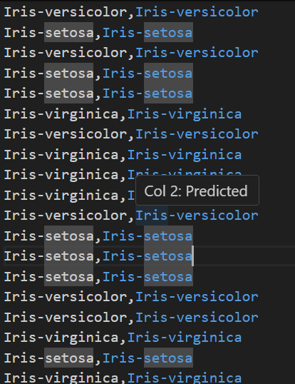
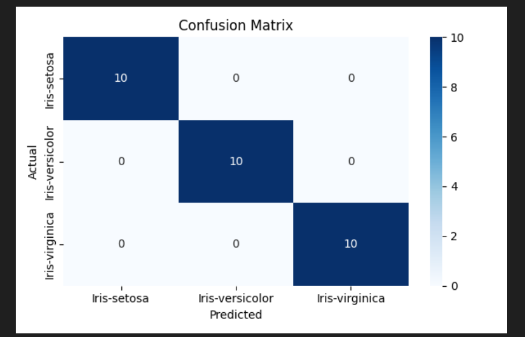

# Iris_dataset
#  Iris Flower Classification - Deep Learning with Docker

This project demonstrates the process of building, training, and deploying a deep learning model for Iris flower classification using PyTorch inside Docker containers. The goal is to showcase the end-to-end pipeline from data preprocessing to model inference, all encapsulated within Docker for reproducibility and modularity.

---

Iris_dataset/
│
├── data/                            # Preprocessed dataset files
│   ├── iris_train.csv              # Preprocessed training data
│   └── iris_inference.csv          # Preprocessed inference data
│
├── training/                        # Training pipeline
│   ├── Dockerfile                  # Dockerfile for training
│   ├── train.py                    # PyTorch training script
│   ├── model.pth                   # Saved trained model
│   └── requirements.txt           # Python dependencies for training
│
├── inference/                       # Inference pipeline
│   ├── Dockerfile                  # Dockerfile for inference
│   ├── inference.py                # Batch inference script using the trained model
│   └── requirements.txt           # Python dependencies for inference
│
├── scripts/                         # Utility scripts
│   └── preprocess.py              # Script for downloading and preprocessing the dataset
│
├── tests/                           # Unit tests for training and inference
│   ├── test_training.py           # Unit tests for training pipeline
│   └── test_inference.py          # Unit tests for inference pipeline
│
├── .gitignore                       # Git ignore file (e.g., ignores models, logs)
└── README.md                        # Project documentation

# Step 1: Clone the Repository
git clone https://github.com/yourusername/Iris_dataset.git
cd Iris_dataset

# Step 2: Preprocess the Dataset
python scripts/preprocess.py

# Step 3: Build Docker Image for Training
docker build -f training/Dockerfile -t iris-train .

# Step 4: Run Docker Container for Training
docker run --rm `
  -v "C:\Users\ashlesha_saxena\Iris_dataset\data:/app/data" `
  -v "C:\Users\ashlesha_saxena\Iris_dataset\training:/app/training" `
  iris-train

# Step 5: Build Docker Image for Inference
docker build -f inference/Dockerfile -t iris-infer .

# Step 6: Run Docker Container for Inference
docker run --rm ^
  -v "C:\Users\ashlesha_saxena\Iris_dataset\data:/app/data" ^
  -v "C:\Users\ashlesha_saxena\Iris_dataset\training:/app/training" ^
  iris-infer

# Step 7 (Optional): Run Unit Tests
pytest tests/test_training.py
pytest tests/test_inference.py
from sklearn.metrics import confusion_matrix, ConfusionMatrixDisplay

cm = confusion_matrix(true_labels, predicted_labels)
ConfusionMatrixDisplay(cm, display_labels=['Setosa', 'Versicolor', 'Virginica']).plot()
# Shared across training/requirements.txt and inference/requirements.txt:
torch
pandas
scikit-learn
numpy
pytest   # Optional, for unit testing
# Features Summary
 Fully Dockerized Training & Inference Pipelines

 Clean Data Preprocessing

 Simple and Effective Neural Network

 Batch Inference with Saved Model

 Unit Testing for Robustness

 Reproducible and Portable Setup

# This documentation
#git clone https://github.com/yourusername/Iris_dataset.git
#cd Iris_dataset
#python scripts/preprocess.py
# output images

